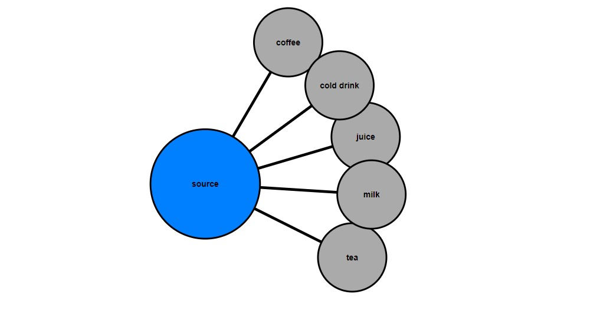
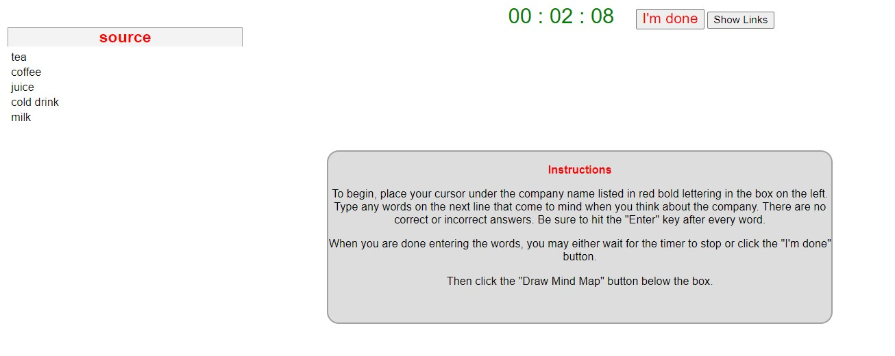
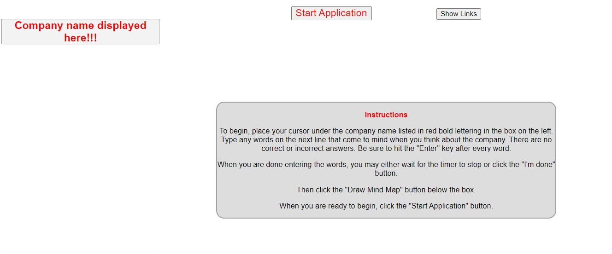

# mind-map-weight

it is a graphical way to represent ideas and concepts. It is a visual thinking tool that helps
structuring information, helping you to better analyze, comprehend, synthesize, and generate new ideas. Its
power lies in its simplicity. I use SVG and D3.js along with HTML, CSS, and JavaScript

we applied frequency weight to unique elements 

